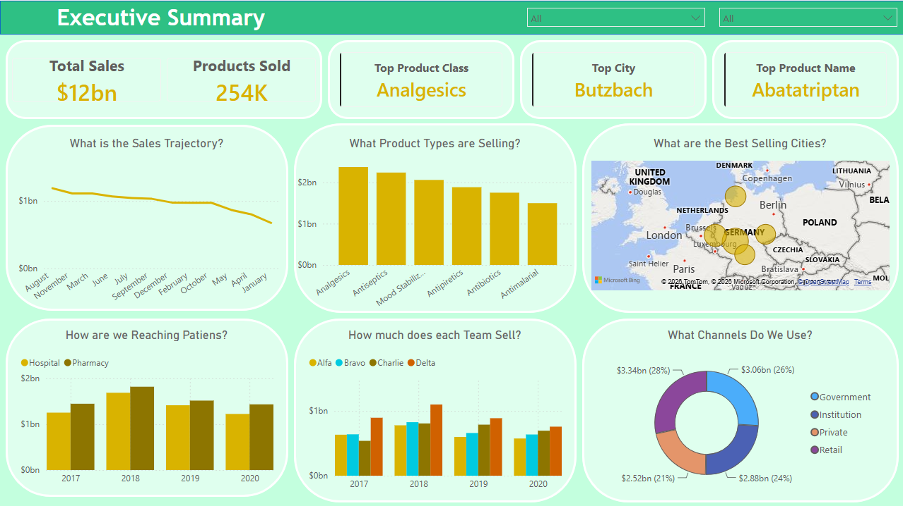
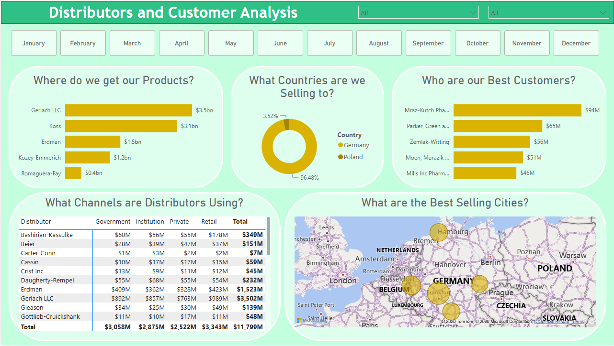
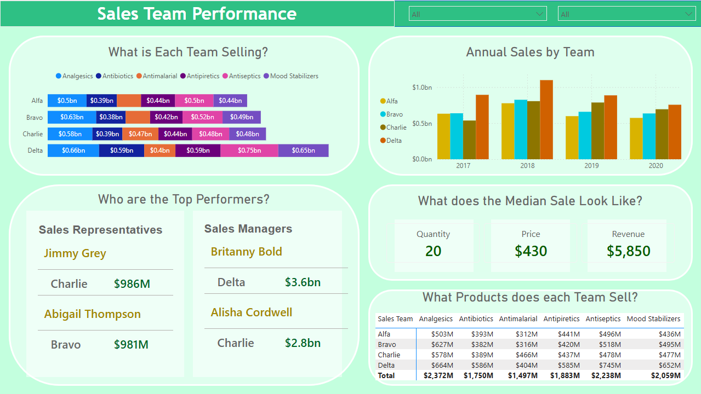

# Pharmaceuticals Sales Analysis — Power BI Dashboard

An interactive Power BI report analyzing pharmaceutical sales across products, distributors, customers, geographies, and internal sales teams. The dashboard turns raw transactional data (~$12bn in sales, 254K products sold) into decision-ready views for executives, account managers, and sales leadership.

## Report Pages

### 1. Executive Summary

A high-level overview of overall sales performance.

- **KPI cards** — Total Sales, Products Sold, Top Product Class, Top City, and Top Product Name.
- **Sales Trajectory** — sales trend over time.
- **Product Types Selling** — sales by product class (Analgesics, Antiseptics, Mood Stabilizers, Antipiretics, Antibiotics, Antimalarial).
- **Best Selling Cities** — geographic bubble map across Europe.
- **How are we Reaching Patients?** — sales split by sub-channel (Hospital vs. Pharmacy) by year.
- **Team Sales** — annual sales comparison across the four sales teams (Alfa, Bravo, Charlie, Delta).
- **Channels** — sales distribution by channel (Government, Institution, Private, Retail).

### 2. Distributors and Customer Analysis

Supply-side and demand-side relationship analysis, with a month slicer.

- **Where do we get our Products?** — sales sourced by distributor.
- **What Countries are we Selling to?** — country distribution (Germany vs. Poland).
- **Who are our Best Customers?** — top customers by revenue.
- **What Channels are Distributors Using?** — distributor-by-channel matrix (Government, Institution, Private, Retail) with totals.
- **Best Selling Cities** — geographic bubble map.

### 3. Sales Team Performance

Performance breakdown across teams and individuals.

- **What is Each Team Selling?** — product-class mix per team (100% stacked bar).
- **Annual Sales by Team** — yearly sales by team.
- **Top Performers** — leading Sales Representatives and Sales Managers by revenue.
- **Median Sale** — median Quantity, Price, and Revenue per transaction.
- **What Products does each Team Sell?** — team-by-product-class revenue matrix with totals.

## Key Features

- **Cross-page slicers** for interactive, drill-down filtering.
- **Geospatial mapping** of sales concentration across European cities.
- **Multi-dimensional analysis** across products, channels, distributors, customers, geographies, and teams.
- **Time-based trends** spanning 2017–2020.

## Data Model

The report is built on pharmaceutical sales transactions with dimensions including:

- **Product** — Product Class and Product Name
- **Geography** — Country and City
- **Channel** — Government, Institution, Private, Retail (with Hospital / Pharmacy sub-channels)
- **Distributor** and **Customer**
- **Sales Team** — Alfa, Bravo, Charlie, Delta — with Sales Representatives and Sales Managers
- **Date** — spanning 2017–2020

> Note: The dataset is sample/synthetic data used for demonstration purposes.

## Getting Started

1. Install [Power BI Desktop](https://powerbi.microsoft.com/desktop/) (free).
2. Clone or download this repository.
3. Open `Pharmaceuticals Analysis.pbix` in Power BI Desktop.
4. Interact with the slicers and visuals, or publish to the Power BI Service to share.

## Repository Contents

| File                            | Description                                   |
| ------------------------------- | --------------------------------------------- |
| `Pharmaceuticals Analysis.pbix` | The Power BI report file                      |
| `Screenshots/Pharma1.PNG`       | Executive Summary screenshot                  |
| `Screenshots/Pharma2.PNG`       | Distributors and Customer Analysis screenshot |
| `Screenshots/Pharma3.PNG`       | Sales Team Performance screenshot             |

## Author

**Evan Ingalls**
